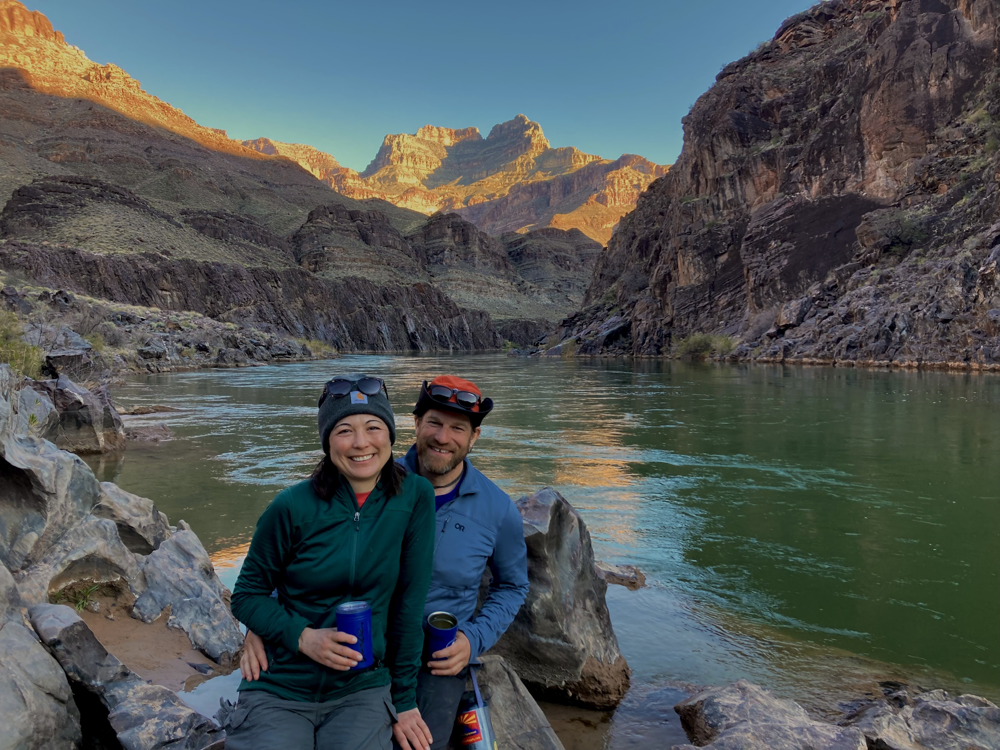
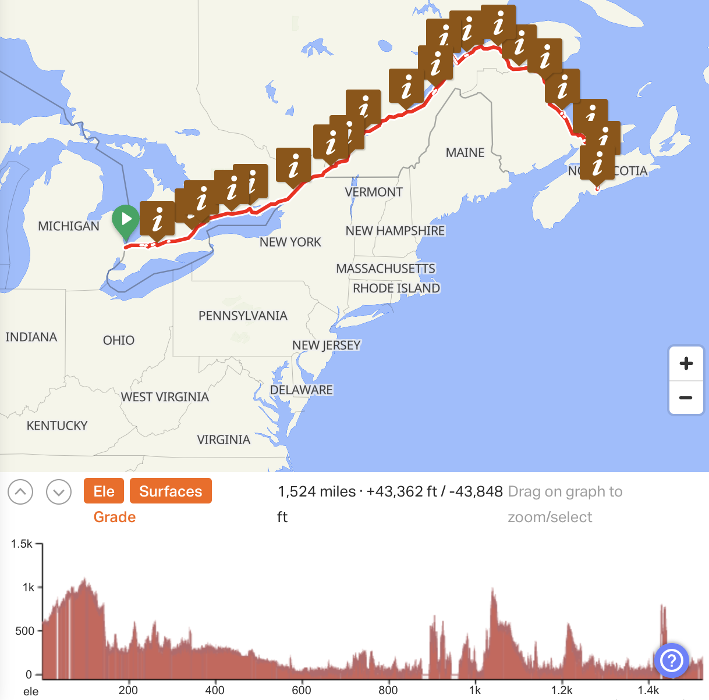

# Oh, Canada

The Grand Canyon rafting was over a year ago. Time to get back out into the world!

So....it's north and east, through Canada. 1,500 miles from Sarnia, Ontario, over 25 days, to the sea and Halifax, nova Scotia! 

